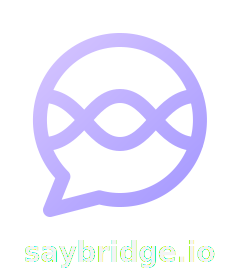

<div align="center">
  <a href="https://saybridge.io">
    
  </a>

  <h1>Saybridge Backend Engine</h1>

  <p><b>High-Performance, Real-Time Messaging & Workflow Automation Server</b></p>

  <br />

  [](https://go.dev/)
  [](https://gin-gonic.com/)
  [](LICENSE)
  [](http://makeapullrequest.com)

  <br />
  <br />

  *A secure, cloud-native backend powering real-time workspace collaborations, workflows, and integrations.*
</div>

---

## ⚡ Overview

**Saybridge Backend** is a blazing-fast, unified communication engine designed as a highly scalable and extensible alternative to Slack or Discord. Built in **Go**, it combines low-latency REST APIs with a robust WebSocket Gateway, event-driven pub-sub message routing, full-text search indexing, and a dynamic runtime plugin model.

---

## 🌟 Key Features

### 📡 Core & Communication
* **Real-time Gateway** — WebSocket connections managed via Gorilla WebSocket, supporting online presence tracking, user typing indicators, and millisecond message broadcasts.
* **Pub-Sub Clustering** — Powered by **NATS JetStream** to seamlessly distribute system events, WebSocket messaging, and background jobs across multiple server instances.
* **Unified File Pipeline** — Direct binary multipart uploads with S3-compatible cloud object storage integration (**MinIO** / AWS S3) and secure authenticated URL signing.
* **WebRTC Integration** — Real-time audio/video calls powered by **LiveKit** integration.

### 🧩 Plugin & Extensibility Architecture
* **Modular Hook System** — Run-time hook registry allows plugins to intercept core actions (e.g., authentication, message sending, room creation) and stop propagation or mutate payloads.
* **Dynamic Server-Driven UI (SDUI)** — Seamlessly delivers visual schema configurations directly to frontend clients via plugin manifests.
* **Standalone Iframe UI Support** — Host admin tools and extensions securely via isolated iframe bridges using `SaybridgeSDK.api` postMessage proxies.

### 🛡️ Enterprise Security
* **Asymmetric Crypto Tokens** — Secure stateless sessions utilizing RS256 RSA JWT asymmetric keypairs.
* **Password Hashing** — Advanced password security with OWASP-recommended **Argon2id** hashing.
* **Sliding Rate Limiter** — Advanced rate-limiting middleware backed by **Redis** to shield API endpoints from brute force and denial of service.
* **Compliance Ready** — XSS sanitization filters and strict CORS configuration.

---

## 🏗️ Architecture Stack

```
                     ┌───────────────────┐
                     │   Client Devices  │
                     │ (Web, Mobile, PC) │
                     └─────────┬─────────┘
                               │ (REST / WebSocket)
        ┌──────────────────────▼──────────────────────┐
        │               Saybridge Backend             │
        │  ┌────────────────────────┬──────────────┐  │
        │  │     REST API Server    │  WS Gateway  │  │
        │  │      (Gin Gonic)       │  (Gorilla)   │  │
        │  └───────────┬────────────┴──────┬───────┘  │
        │              │ (Google Wire DI)  │          │
        │              ▼                   ▼          │
        │       [Internal Services & Hook Plugins]    │
        └──────────────────────┬──────────────────────┘
                               │
       ┌───────────┬───────────┼───────────┬───────────┐
       ▼           ▼           ▼           ▼           ▼
  ┌─────────┐ ┌─────────┐ ┌─────────┐ ┌─────────┐ ┌─────────┐
  │Postgres │ │  Redis  │ │  NATS   │ │  MinIO  │ │  Meili  │
  │+ Timescale││(Session│ │(PubSub) │ │ (Object │ │ (Search │
  │ (Data)  │ │& Cache) │ │         │ │Storage) │ │ Engine) │
  └─────────┘ └─────────┘ └─────────┘ └─────────┘ └─────────┘
```

---

## 📁 Directory Structure

The project follows a standard, clean Go layout separating application startup, core domain logic, and reusable packages:

```text
├── cmd/
│   ├── api/             # Entry point for the Gin REST API HTTP Server
│   ├── gateway/         # Entry point for the WebSocket Gateway Server
│   ├── migrate/         # Database migration runner scripts
│   ├── seed/            # Development data seeder (Tenant, Super Admin)
│   └── chat-cli/        # Developer-only WebSocket terminal chat client
├── docs/                # Auto-generated Swagger documentation
├── internal/
│   ├── app/             # Application container and Google Wire dependency setup
│   ├── config/          # Configurations parsing from environment/dot-env
│   ├── domain/          # Shared domain models and entities
│   ├── http/            # HTTP Handlers, API controllers, and middlewares
│   ├── repositories/    # Database queries and repositories (PostgreSQL / GORM)
│   ├── gateway/         # WebSocket hubs, connection managers, and client handlers
│   └── plugin/          # Core hook-registry and runtime plugin loader
├── pkg/                 # Shared, reusable packages
│   ├── crypto/          # Argon2id password hashing and RS256 JWT utilities
│   ├── logger/          # Zap-based structured logger
│   └── response/        # Standardized API response formatters
└── plugins/             # Extensible backend plugins (e.g. Workflow, AI-Agent)
```

---

## 🚀 Getting Started

### Prerequisites

Ensure you have the following installed on your machine:
* **Go** (version 1.26+)
* **Docker & Docker Compose v2** (to boot infrastructure services)
* **Air** (for hot-reloading in development: `go install github.com/air-verse/air@latest`)
* **Google Wire** (for DI generation: `go install github.com/google/wire/cmd/wire@latest`)

### 1. Clone & Set Up Environment

Copy the template environment configuration file and adjust variables if needed:
```bash
cp .env.example .env
```

### 2. Launch Services

Start database, redis, NATS, MinIO, and Meilisearch dependencies using Docker Compose:
```bash
# From the project root (if using the monorepo) or via your custom stack:
docker compose up -d
```

### 3. Build & Run Application

Use the included `Makefile` targets to spin up the services:

* **Generate Dependency Injection:**
  ```bash
  make wire
  ```

* **Run Database Migrations & Seed Data:**
  ```bash
  go run ./cmd/migrate/
  make seed
  ```

* **Run REST API Server (with hot-reload):**
  ```bash
  make dev
  ```

* **Run WebSocket Gateway Server (with hot-reload):**
  ```bash
  make dev-gateway
  ```

* **Execute Unit Tests:**
  ```bash
  make test
  ```

---

## 🛠️ Configuration (.env)

| Variable | Description | Default |
| :--- | :--- | :--- |
| `PORT` | API Server listening port | `8080` |
| `ENV` | Environment environment | `development` |
| `DB_HOST` | PostgreSQL Database hostname | `localhost` |
| `REDIS_HOST` | Redis Server hostname | `localhost` |
| `NATS_URL` | NATS Event Broker URL | `nats://localhost:4222` |
| `MINIO_ENDPOINT` | MinIO S3 API Endpoint | `localhost:9005` |
| `MEILI_URL` | Meilisearch server API URL | `http://localhost:7700` |
| `JWT_PRIVATE_KEY_PATH` | Path to private RSA Key | `keys/app.rsa` |

---

## 📄 License

This project is licensed under the **AGPL-3.0 License** - see the [LICENSE](LICENSE) file for details.
